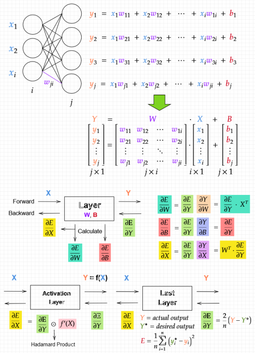

# Neural Network Calculation

Although studying neural networks is enjoyable, it can be challenging to comprehend the calculations involved. Particularly the part about backpropagation. This video provided me with a comprehensive understanding of the entire scene within a network. I meticulously record each step of the calculation. I hope it becomes useful to you in your studies. To edit the formulas, I use the Mathcha online mathematics editor. You may import the.matcha files and log in to make changes.

[Neural Network from Scratch | Mathematics & Python Code](https://www.youtube.com/watch?v=pauPCy_s0Ok&list=PLVxix6-adPnWtHOUKYbHUH4Ns4mDytivn)

[Softmax Layer from Scratch | Mathematics & Python Code](https://www.youtube.com/watch?v=AbLvJVwySEo&list=PLVxix6-adPnWtHOUKYbHUH4Ns4mDytivn&index=2)

[Matcha Online Math Editor](https://www.mathcha.io/)

